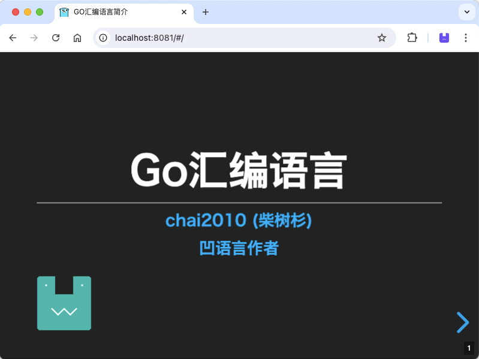

# Go汇编语言简介

- *凹语言™: https://github.com/wa-lang/wa*

---

- [Go汇编语言简介(幻灯片)](https://chai2010.github.io/asmgo-talk/) - by [chai2010](https://github.com/chai2010)
- [《Go语言高级编程》第三章 CGO编程](https://github.com/chai2010/advanced-go-programming-book)
