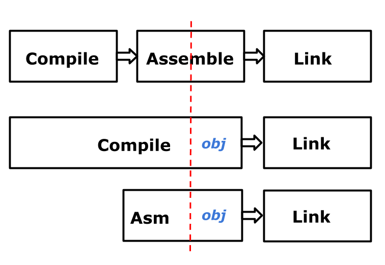

<!--
// Copyright 2018 ChaiShushan <chaishushan{AT}gmail.com>. All rights reserved.
// Use of this source code is governed by a BSD-style
// license that can be found in the LICENSE file.
-->

<!-- ++++++++++++++++++++++++++++++++++++++++++++++++++++++++++++++++++++++  -->

<!-- *** 横向分隔, --- 竖向分隔, Note: 讲稿注释  -->

<!--
Reveal.js 可能会需要 AJAX 异步加载 Markdown 文件, 可以在当前目录启动一个 http 服务.

以下是常见的临时启动 http 服务器的方式:

	NodeJS
	npm install http-server -g
	http-server

	Python2
	python -m SimpleHTTPServer

	Python3
	python -m http.server

	Golang
	go run server.go

启动后, 本地可以访问 http://127.0.0.1:port, 其中 port 为端口号, 命令行有提示.

幻灯片操作: F键全屏, S键显示注解, ESC大纲模式, ESC退出全屏或大纲模式, ?显示帮助

-->

<!-- ++++++++++++++++++++++++++++++++++++++++++++++++++++++++++++++++++++++  -->

# GO汇编语言简介
--------------

#### [chai2010 (柴树杉)](https://chai2010.cn)
#### [@青云QingCloud](https://www.qingcloud.com/)


<!-- ++++++++++++++++++++++++++++++++++++++++++++++++++++++++++++++++++++++  -->
***
### 为何要了解汇编?
----------------

- 挖掘芯片的全部功能 (操作系统引导/进程切换等)
- 挖掘芯片的全部性能 (算法极致优化)

----

- 哪怕只懂一点汇编, 也便于更好地理解计算机
- 汇编语言可以鄙视一切高级语言


<!-- ++++++++++++++++++++++++++++++++++++++++++++++++++++++++++++++++++++++  -->
***
### Plan9汇编
------------

- Ken Thompson, 1986 写的 C 编译器 输出的伪代码
- Plan9汇编 用于手写 输出的伪代码
- 是一种近似跨平台的高级汇编语言

-------------

- Go汇编是基于Plan9汇编演化而来


---
### Go汇编工具链
--------------

####  <!-- .element: style="width:65%;" -->

<!-- ++++++++++++++++++++++++++++++++++++++++++++++++++++++++++++++++++++++  -->
***
## 快速入门
----------

main.go:

```go
package main

var id int       // 声明变量
func getId() int // 声明函数
```

main_amd64.s:

```
#include "textflag.h"

DATA  ·id+0(SB)/8,$9527 // var id int = 9527
GLOBL ·id(SB),NOPTR,$8

TEXT ·getId(SB), $0-8   // func getId() int
	MOVQ ·id(SB), AX    // read id
	MOVQ AX, ret+0(FP)  // return id
	RET
```

----------


---
### 简单说明
-----------

- 变量要在Go语言中声明, 但不能赋值
- 函数要在Go语言中声明, 但不包含函数实现

------

- Go语言中的标识符`x`对应汇编语言中的`·x`

------

- DATA: 定义数据
- GLOBL: 构造全局标识符
- TEXT: 定义函数

<!-- ++++++++++++++++++++++++++++++++++++++++++++++++++++++++++++++++++++++  -->
***

## 特殊字符

- `U+00B7`: 中点`·`, 替代ASCII点`.`, 例如 `fmt.Printf`
- `U+2215`: 除法`/`, 替代路径分隔符`/`, 例如 `math/rand.Int`

-------

- `·`和`/`可以看作是特殊的Unicode字母
- 不需要针对包路径中的`.`和`/`字符设计特殊语法
- `math/rand.Int`自然包含了包路径的信息
- 不受汇编语言的小数点和除法运算符影响


---
## 特殊字符怎么输入?
-----------------

- 从 [/doc/asm](https://golang.org/doc/asm) 官方文档 复制/粘贴

------

- macOS: 不开输入法时，可直接用 option+shift+9 输入
- macOS: 简体拼音输入法，输入左上角`~`键对应`·`
- macOS: Unicode输入法，输入对应的Unicode码点
- Windows: TODO
- Linux: TODO

https://en.wikipedia.org/wiki/Interpunct


<!-- ++++++++++++++++++++++++++++++++++++++++++++++++++++++++++++++++++++++  -->
***

## 伪寄存器
----------

- FP: 帧指针, 参数和局部变量
- PC: 程序计数器, 跳转和分支
- SB: 静态基址指针, 全局符号
- SP: 栈指针, 栈的顶端

- 变量定义（到处/局部可见）
- 函数定义（方法的限制）
- 调用其它函数
- if/goto模拟汇编，局部变量对应寄存器
- 如何通过函数指针调用

<!-- ++++++++++++++++++++++++++++++++++++++++++++++++++++++++++++++++++++++  -->
***
## 更多的例子

- Add

---
### Add
-------

```
#include "textflag.h"

// func Add(a, b int) int
TEXT ·Add(SB), NOSPLIT, $0-24
	MOVQ a+0(FP), AX    // a
	MOVQ b+8(FP), BX    // b
	ADDQ AX, BX         // a+b
	MOVQ BX, ret+16(FP) // return a+b
	RET
```

---
### If
------

```
// func If(ok bool, a, b int) int
TEXT ·If(SB), NOSPLIT, $0-32
	MOVBQZX ok+0(FP), AX // ok
	MOVQ a+8(FP), BX     // a
	MOVQ b+16(FP), CX    // b
	CMPQ AX, $0          // test ok
	JEQ  3(PC)           // if !ok, skip 2 line
	MOVQ BX, ret+24(FP)  // return a
	RET
	MOVQ CX, ret+24(FP)  // return b
	RET
```

---
### Loop
--------

```
// func LoopAdd(cnt, v0, step int) int
TEXT ·LoopAdd(SB), NOSPLIT, $0-32
	MOVQ cnt+0(FP), AX   // cnt
	MOVQ v0+8(FP), BX    // v0
	MOVQ step+16(FP), CX // step

loop:
	CMPQ AX, $0 // compare cnt,0
	JLE  end    // if cnt <= 0: go end
	DECQ AX     // cnt--
	ADDQ CX, BX // v0 += step
	JMP  loop   // goto loop

end:
	MOVQ BX, ret+24(FP)  // return v0
	RET
```

---
### min
-------

```
// func Min(a, b int) int
TEXT ·Min(SB), NOSPLIT, $0-24
	MOVQ a+0(FP), AX    // a
	MOVQ b+8(FP), BX    // b
	CMPQ AX, BX         // compare a, b
	JGT  3(PC)          // if a>b, skip 2 line
	MOVQ AX, ret+16(FP) // return a
	RET
	MOVQ BX, ret+16(FP) // return b
	RET
```

---
### max
-------

```
// func Max(a, b int) int
TEXT ·Max(SB), NOSPLIT, $0-24
	MOVQ a+0(FP), AX    // a
	MOVQ b+8(FP), BX    // b
	CMPQ AX, BX         // compare a, b
	JLT  3(PC)          // if a<b, skip 2 line
	MOVQ AX, ret+16(FP) // return a
	RET
	MOVQ BX, ret+16(FP) // return b
	RET
```


---
### `textflag.h`
----------------

```c
...

// Don't insert stack check preamble.
#define NOSPLIT	4
// Put this data in a read-only section.
#define RODATA	8
// This data contains no pointers.
#define NOPTR	16

...
```


<!-- 限制？ -->


<!--方法，指针方法? -->


<!--


	println(aa)
}

func main()

-->

<!-- ++++++++++++++++++++++++++++++++++++++++++++++++++++++++++++++++++++++  -->
***

## 参考资源

- https://golang.org/doc/asm
- https://9p.io/sys/doc/asm.html
- https://talks.golang.org/2016/asm.slide

<!--

- https://golang.org/src/cmd/compile/internal/gc/builtin/runtime.go

- https://github.com/klauspost/asmfmt
- https://github.com/minio/asm2plan9s

- https://github.com/klauspost/asmfmt/tree/master/testdata

- https://goroutines.com/asm
- http://nelhagedebugsshit.tumblr.com/post/84342207533/things-i-learned-writing-a-jit-in-go

- https://www.doxsey.net/blog/go-and-assembly
- https://github.com/golang/go/issues/4978
- https://groups.google.com/forum/#!topic/golang-nuts/emLyuXwxImU
- https://stackoverflow.com/questions/45937105/underline-implement-of-golang-method-using-golang-assembly-language

- https://github.com/golang/go/wiki/GcToolchainTricks

-->

<!-- ++++++++++++++++++++++++++++++++++++++++++++++++++++++++++++++++++++++  -->
***

## Thank you

#### [https://github.com/chai2010](https://github.com/chai2010)

#### [https://chai2010.cn](https://chai2010.cn)

#### [@青云QingCloud](https://www.qingcloud.com/)


<!-- ++++++++++++++++++++++++++++++++++++++++++++++++++++++++++++++++++++++  -->
