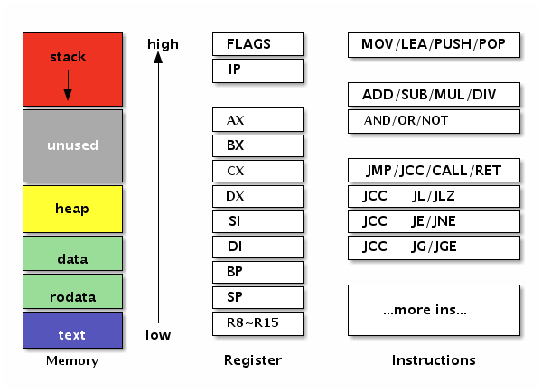

<!--
// Copyright 2018 ChaiShushan <chaishushan{AT}gmail.com>. All rights reserved.
// Use of this source code is governed by a BSD-style
// license that can be found in the LICENSE file.
-->

<!-- ++++++++++++++++++++++++++++++++++++++++++++++++++++++++++++++++++++++  -->

<!-- *** 横向分隔, --- 竖向分隔, Note: 讲稿注释  -->

<!--
Reveal.js 可能会需要 AJAX 异步加载 Markdown 文件, 可以在当前目录启动一个 http 服务.

以下是常见的临时启动 http 服务器的方式:

	NodeJS
	npm install http-server -g
	http-server

	Python2
	python -m SimpleHTTPServer

	Python3
	python -m http.server

	Golang
	go run server.go

启动后, 本地可以访问 http://127.0.0.1:port, 其中 port 为端口号, 命令行有提示.

幻灯片操作: F键全屏, S键显示注解, ESC大纲模式, ESC退出全屏或大纲模式, ?显示帮助

-->

<!-- ++++++++++++++++++++++++++++++++++++++++++++++++++++++++++++++++++++++  -->

# Go汇编语言
-----------

#### [chai2010 (柴树杉)](https://chai2010.cn)
#### [@青云QingCloud](https://www.qingcloud.com/)


<!-- ++++++++++++++++++++++++++++++++++++++++++++++++++++++++++++++++++++++  -->
***
## 汇编语言的价值
--------------

- 挖掘芯片的全部功能 (操作系统引导/进程切换等)
- 挖掘芯片的全部性能 (算法极致优化)

----

- 哪怕只懂一点汇编, 也便于更好地理解计算机
- 汇编语言可以鄙视一切高级语言


---
### Plan9汇编语言
----------------

- Ken Thompson, 1986 写的 C 编译器 输出的伪代码
- Plan9汇编 用于手写 输出的伪代码
- 是一种近似跨平台的高级汇编语言

-------------

- Go汇编是基于Plan9汇编演化而来


<!-- ++++++++++++++++++++++++++++++++++++++++++++++++++++++++++++++++++++++  -->
***
## 快速入门
----------

```go
package pkg

var helloworld string = "Hello World!"

func HelloWorld() {
	println(helloworld)
}
```

------

- 重新用汇编语言实现

---
### 汇编语言实现
--------------

```
#include "textflag.h"

// var helloworld string
GLOBL ·helloworld(SB),NOPTR,$32                  // var helloworld [32]byte
	DATA ·helloworld+0(SB)/8,$·helloworld+16(SB) // StringHeader.Data
	DATA ·helloworld+8(SB)/8,$12                 // StringHeader.Len
	DATA ·helloworld+16(SB)/8,$"Hello Wo"        // ...string data...
	DATA ·helloworld+24(SB)/8,$"rld!"            // ...string data...

// func HelloWorld()
TEXT ·HelloWorld(SB), $16-0
	MOVQ ·helloworld+0(SB), AX; MOVQ AX, 0(SP)
	MOVQ ·helloworld+8(SB), BX; MOVQ BX, 8(SP)
	CALL runtime·printstring(SB)
	CALL runtime·printnl(SB)
	RET
```

----------


---
### 汇编语法
-----------

- 变量要在Go语言中声明, 但不能赋值
- 函数要在Go语言中声明, 但不包含函数实现

------

- Go语言中的标识符`x`对应汇编语言中的`·x`

------

- GLOBL: 定义全局标识符, 分配内存空间
- DATA: 初始化对应内存空间
- TEXT: 定义函数


---
### 字符串结构
-------------

```go
var helloworld string // 只能声明, 不能赋值
```

```go
// +---------------------------+              ·helloworld+0(SB)
// | reflect.StringHeader.Data | ----------\ $·helloworld+16(SB)
// +---------------------------+           |
// | reflect.StringHeader.Len  |           |
// +---------------------------+ <---------/  ·helloworld+16(SB)
// | "Hello World!"            |
// +---------------------------+
```

-------

- 字符串的数据紧挨字符串头结构体
- `$·helloworld+16(SB)` 表示符号地址
- `·helloworld+16(SB)` 表示符号地址内的数据


---
### HelloWorld函数
-----------------

```go
func HelloWorld() // 只能声明, 不能定义
```

```
TEXT ·HelloWorld(SB), $16-0
	MOVQ ·helloworld+0(SB), AX; MOVQ AX, 0(SP)
	MOVQ ·helloworld+8(SB), BX; MOVQ BX, 8(SP)
	CALL runtime·printstring(SB)
	CALL runtime·printnl(SB)
	RET
```

------

- `$16-0`中的16: 表示函数内部有16字节用于局部变量
- `$16-0`中的0: 表示函数参数和返回值总大小为0

------

- `printstring`的参数类型为`StringHeader`
- `0(SP)`为`StringHeader.Data`
- `8(SP)`为`StringHeader.Len`


---
### 简化: 在Go中定义变量
---------------------

```go
var helloworld string = "你好, 中国!"

func HelloWorld()
```

```
TEXT ·HelloWorld(SB), $16-0
	MOVQ ·helloworld+0(SB), AX; MOVQ AX, 0(SP)
	MOVQ ·helloworld+8(SB), BX; MOVQ BX, 8(SP)
	CALL runtime·printstring(SB)
	CALL runtime·printnl(SB)
	RET
```

-------------

- 汇编定义变量没有太多优势, 性价比较低
- 汇编的优势是挖掘芯片的功能和性能

---
### 没有分号
----------

- 分号用于分隔多个汇编语句
- 行末尾自动添加分号

<!-- ++++++++++++++++++++++++++++++++++++++++++++++++++++++++++++++++++++++  -->
***
## 特殊字符
----------

- `U+00B7`: 中点`·`, 替代ASCII点`.`, 例如 `fmt.Printf`
- `U+2215`: 除法`/`, 替代路径分隔符`/`, 例如 `math/rand.Int`

-------

- `·`和`/`可以看作是特殊的Unicode字母
- 不需要针对包路径中的`.`和`/`字符设计特殊语法
- `math/rand.Int`自然包含了包路径的信息
- 不受汇编语言的小数点和除法运算符影响


---
## 特殊字符怎么输入?
-----------------

- 从 [/doc/asm](https://golang.org/doc/asm) 官方文档 复制/粘贴

------

- macOS: 不开输入法时，可直接用 option+shift+9 输入
- macOS: 简体拼音输入法，输入左上角`~`键对应`·`
- macOS: Unicode输入法，输入对应的Unicode码点
- Windows: TODO
- Linux: TODO

-----

- https://en.wikipedia.org/wiki/Interpunct


---
## 更多的特殊字符?
---------------

-  https://github.com/golang/go/pull/25274
- `pkg.(*T).Method` ?


<!-- ++++++++++++++++++++++++++++++++++++++++++++++++++++++++++++++++++++++  -->
***
## 冯·诺伊曼 计算机
-----------------

- CPU/内存/IO设备
- 程序也是数据, 存储程序, 统一编址
- 哈弗结构: 程序和数据分开编址

-------------------

- CPU 提供一组高速寄存器
- 所有的运算只能在寄存器中进行
- 内存 和 寄存器 之间的数据传输有专有的指令

----------

- 汇编核心内容: 寄存器, 指令, 内存


---
### 内存布局(A)
-------------

#### 


---
### 内存布局(B)
-------------

- text: 代码段
- rodata: 常量段
- data: 全局变量
- heap: 堆, 动态内存管理
- stack: 栈, 函数调用栈帧, 局部变量等信息


---
### 寄存器
---------

- AMD64: AX, BX, CX, DX, SI, DI, SP, BP, SP, R8~R15
- ARM64: R0~R31

-------

- `MOVE a+0(FP) AX`
- `ADDQ AX BX`

---
### 伪寄存器(Go汇编)
------------------

- SB: 静态基址指针, 全局符号
- FP: 帧指针, 参数和局部变量
- SP: 栈指针, 栈的顶端
- PC: 程序计数器, 跳转和分支

--------

- `GLOBL text(SB),$1`: 全局变量
- `MOVQ a+0(FP) AX`: 函数参数
- `MOVQ b+8(SP) AX`: 局部变量
- `JMP  2(PC)`: 向前跳转


---
### 基本指令类型
--------------

- 数据传输: MOVE, 寄存器 <==> 内存
- CPU 无法对内存的数据进行直接运算

-----------------

- 跳转指令: JMP, 有条件跳转
- 可实现if/else/for等控制结构
- 可绝对地址或相对地址跳转

-----------------

- 逻辑运算: 配合跳转指令
- 算术运算

<!-- ++++++++++++++++++++++++++++++++++++++++++++++++++++++++++++++++++++++  -->
***
## 常量
------

- `$`前缀表示常量
- 整数常量: 十进制/十六进制
- 浮点数常量: 科学计数法?
- 字符/字符串常量
- 标识符/标号
- 常量表达式


---
### 常量示例
-----------

```
$1           // 十进制
$0xf4f8fcff  // 十六进制
$1.5         // 浮点数
$'a'         // 字符
$"abcd"      // 字符串
$1+2         // 常量表达式
```

------

- 没有类型bool, byte代替
- 最终常量不得超出变量能表示的范围


<!-- ++++++++++++++++++++++++++++++++++++++++++++++++++++++++++++++++++++++  -->
***
## 变量
------

- 基本语法

---------

- bool/byte/int/int64/float32/float64/...
- string/slice
- map/channel

---------

- NOPTR/RODATA
- 仅文件内可见


---
### 基本语法
-----------

```
GLOBL ·count(SB),$4
```

```
DATA ·count+0(SB)/1,$1
DATA ·count+1(SB)/1,$2
DATA ·count+2(SB)/2,$3
```

------

- `GLOBL` 定义全局变量, 只有内存大小, 不包含类型
- `DATA` 符号对应偏移量, 制定宽度内存内的数据


---
### bool型变量
-------------

```
GLOBL ·boolValue(SB),$1   // 未初始化

GLOBL ·trueValue(SB),$1   // var trueValue = true
DATA ·trueValue(SB)/1,$1  // 非 0 均为 true

GLOBL ·falseValue(SB),$1  // var falseValue = true
DATA ·falseValue(SB)/1,$0
```

------

- 没有bool类型, 定义1字节大小内存即可
- 非 0 均为 true

---
### int型变量
------------

```
GLOBL ·int32Value(SB),$4
DATA ·int32Value+0(SB)/1,$0x01  // 第0字节
DATA ·int32Value+1(SB)/1,$0x02  // 第1字节
DATA ·int32Value+2(SB)/2,$0x03  // 第3-4字节

GLOBL ·uint32Value(SB),$4
DATA ·uint32Value(SB)/4,$0x01020304 // 第1-4字节
```

------

- 不区分 int 和 uint 类型


---
### float型变量
------------


```
GLOBL ·float32Value(SB),$4
DATA ·float32Value+0(SB)/4,$1.5      // var float32Value = 1.5

GLOBL ·float64Value(SB),$8
DATA ·float64Value(SB)/4,$0x01020304 // bit 方式初始化
```

------

- float32/float64 遵循 IEEE754标准
- 作为无符号整数类型时, 整数如果有序, 浮点数也有序

---
### IEEE754 浮点数标准
--------------------

###### 

------------

- 符号位1bit, 在最高位
- float32 指数位为 8bit, 采用移码表示, 在次高位
- 剩余为有效位, 整数部分的1bit省略

--------

- 有2个0: +0, -0
- 有无穷大和无穷小, 无穷有正负之分
- 存在非数 inf

---
### string类型变量
-----------------

TODO

---
### slice类型变量
---------------

TODO


---
### map/channel类型变量
----------------------

TODO


---
### 结构体
---------

TODO


---
### 特殊标志
----------

- 仅文件内可见
- rodata 段的只读量
- 不含指针

<!--

// var helloworld string
GLOBL ·helloworld(SB),NOPTR,$32                  // var helloworld [32]byte
    DATA ·helloworld+0(SB)/8,$·helloworld+16(SB) // StringHeader.Data
    DATA ·helloworld+8(SB)/8,$12                 // StringHeader.Len
    DATA ·helloworld+16(SB)/8,$"Hello Wo"        // ...string data...
    DATA ·helloworld+24(SB)/8,$"rld!"            // ...string data...


传统汇编的 section 分布

全局变量
局部变量

ram/rom 区别？
flash 区别？
 -->

---
### 基本语法
-----------

```
DATA symbol+offset(SB)/width, value
```

--------

```
DATA divtab<>+0x00(SB)/4, $0xf4f8fcff
DATA divtab<>+0x04(SB)/4, $0xe6eaedf0
...
DATA divtab<>+0x3c(SB)/4, $0x81828384
GLOBL divtab<>(SB), RODATA, $64

GLOBL runtime·tlsoffset(SB), NOPTR, $4
```

----------

<!--
- 常量: 字符串/十进制数/十六进制数

怎么引用其它pkg的变量？

不给初始化值可以吗？

全局变量容易导致污染名字空间，最好是文件内部，或者是包内部
-->


TODO


<!-- ++++++++++++++++++++++++++++++++++++++++++++++++++++++++++++++++++++++  -->
***
## 函数
-------

TODO

<!--
不足之处
指针类型的方法没有办法定义(目前汇编不支持)

https://talks.golang.org/2016/asm.slide#35

ADDW AX, BX

&obj.Prog{
    As: arch.Instructions["ADDW"],
    From: obj.Addr{Reg: arch.Register["AX"]},
    To: obj.Addr{Reg: arch.Register["BX"]},
    ...
}

-->


<!-- ++++++++++++++++++++++++++++++++++++++++++++++++++++++++++++++++++++++  -->
***
## 寻址模式
----------

TODO


<!-- ++++++++++++++++++++++++++++++++++++++++++++++++++++++++++++++++++++++  -->
***
## 类C预处理器
------------

TODO


---
### `textflag.h`
----------------

```c
...

// Don't insert stack check preamble.
#define NOSPLIT	4
// Put this data in a read-only section.
#define RODATA	8
// This data contains no pointers.
#define NOPTR	16

...
```


<!-- ++++++++++++++++++++++++++++++++++++++++++++++++++++++++++++++++++++++  -->
***
## 宏函数
--------

TODO


<!-- ++++++++++++++++++++++++++++++++++++++++++++++++++++++++++++++++++++++  -->
***
## 伪寄存器
----------

TODO

<!--

- FP: 帧指针, 参数和局部变量
- PC: 程序计数器, 跳转和分支
- SB: 静态基址指针, 全局符号
- SP: 栈指针, 栈的顶端

- 变量定义（到处/局部可见）
- 函数定义（方法的限制）
- 调用其它函数
- if/goto模拟汇编，局部变量对应寄存器
- 如何通过函数指针调用

-->


<!-- ++++++++++++++++++++++++++++++++++++++++++++++++++++++++++++++++++++++  -->
***
## 函数调用规范
------------

TODO


<!-- ++++++++++++++++++++++++++++++++++++++++++++++++++++++++++++++++++++++  -->
***
## 更多的例子
-----------

TODO

<!--
- 动态栈
- 递归
- gc
- 方法，指针方法
-->


---
### Add
-------

```
#include "textflag.h"

// func Add(a, b int) int
TEXT ·Add(SB), NOSPLIT, $0-24
	MOVQ a+0(FP), AX    // a
	MOVQ b+8(FP), BX    // b
	ADDQ AX, BX         // a+b
	MOVQ BX, ret+16(FP) // return a+b
	RET
```

---
### If
------

```
// func If(ok bool, a, b int) int
TEXT ·If(SB), NOSPLIT, $0-32
	MOVBQZX ok+0(FP), AX // ok
	MOVQ a+8(FP), BX     // a
	MOVQ b+16(FP), CX    // b
	CMPQ AX, $0          // test ok
	JEQ  3(PC)           // if !ok, skip 2 line
	MOVQ BX, ret+24(FP)  // return a
	RET
	MOVQ CX, ret+24(FP)  // return b
	RET
```

---
### Loop
--------

```
// func LoopAdd(cnt, v0, step int) int
TEXT ·LoopAdd(SB), NOSPLIT, $0-32
	MOVQ cnt+0(FP), AX   // cnt
	MOVQ v0+8(FP), BX    // v0
	MOVQ step+16(FP), CX // step

loop:
	CMPQ AX, $0 // compare cnt,0
	JLE  end    // if cnt <= 0: go end
	DECQ AX     // cnt--
	ADDQ CX, BX // v0 += step
	JMP  loop   // goto loop

end:
	MOVQ BX, ret+24(FP)  // return v0
	RET
```

---
### min
-------

```
// func Min(a, b int) int
TEXT ·Min(SB), NOSPLIT, $0-24
	MOVQ a+0(FP), AX    // a
	MOVQ b+8(FP), BX    // b
	CMPQ AX, BX         // compare a, b
	JGT  3(PC)          // if a>b, skip 2 line
	MOVQ AX, ret+16(FP) // return a
	RET
	MOVQ BX, ret+16(FP) // return b
	RET
```

---
### max
-------

```
// func Max(a, b int) int
TEXT ·Max(SB), NOSPLIT, $0-24
	MOVQ a+0(FP), AX    // a
	MOVQ b+8(FP), BX    // b
	CMPQ AX, BX         // compare a, b
	JLT  3(PC)          // if a<b, skip 2 line
	MOVQ AX, ret+16(FP) // return a
	RET
	MOVQ BX, ret+16(FP) // return b
	RET
```


<!-- ++++++++++++++++++++++++++++++++++++++++++++++++++++++++++++++++++++++  -->
***
## Go核心对象结构
---------------

TODO

<!--
方法
接口
类型
类型断言
类型查询
管道
G/M
goroutine_id

用Go代码表示汇编对象
/cmd/internal/obj
-->

<!-- ++++++++++++++++++++++++++++++++++++++++++++++++++++++++++++++++++++++  -->
***
## runtime内置函数
----------------

TODO


<!-- ++++++++++++++++++++++++++++++++++++++++++++++++++++++++++++++++++++++  -->
***
## 调用C函数
-----------

TODO

<!--
不考虑阻塞和栈

如果考虑栈，则准备一个大的栈?

对于特殊限制的C函数，比较多余的开销

可能无法访问c的符号，但是可以通过函数指针调用
-->


<!-- ++++++++++++++++++++++++++++++++++++++++++++++++++++++++++++++++++++++  -->
***
## AVX/SSE指令
-------------

TODO

<!-- ++++++++++++++++++++++++++++++++++++++++++++++++++++++++++++++++++++++  -->
***
## ARM汇编
---------

TODO


<!-- ++++++++++++++++++++++++++++++++++++++++++++++++++++++++++++++++++++++  -->
***
## 补充部分
---------

- 标识符的命名, 避免全局的名字冲突

<!--
//go:nosplit
//go:noinline
-->


<!-- ++++++++++++++++++++++++++++++++++++++++++++++++++++++++++++++++++++++  -->
***
## 参考资源

#### https://golang.org/doc/asm
#### https://9p.io/sys/doc/asm.html
#### https://talks.golang.org/2016/asm.slide
#### https://github.com/klauspost/asmfmt
#### https://github.com/minio/asm2plan9s

-------

#### [runtime builtin functions](https://golang.org/src/cmd/compile/internal/gc/builtin/runtime.go)

<!--

- https://github.com/klauspost/asmfmt/tree/master/testdata

- https://goroutines.com/asm
- http://nelhagedebugsshit.tumblr.com/post/84342207533/things-i-learned-writing-a-jit-in-go

- https://www.doxsey.net/blog/go-and-assembly
- https://github.com/golang/go/issues/4978
- https://groups.google.com/forum/#!topic/golang-nuts/emLyuXwxImU
- https://stackoverflow.com/questions/45937105/underline-implement-of-golang-method-using-golang-assembly-language

- https://github.com/golang/go/wiki/GcToolchainTricks

- http://luodw.cc/2016/09/04/golang03/
- https://cordate.github.io/2018/04/11/golang/Go%E7%9A%84%E6%B1%87%E7%BC%96%E7%A8%8B%E5%BA%8F%E5%BF%AB%E9%80%9F%E6%8C%87%E5%8D%97/

- http://xargin.com/go-and-plan9-asm/
- http://xargin.com/plan9-assembly/

- http://colobu.com/goasm/
- https://toutiao.io/posts/52u5kg/preview
- https://studygolang.com/articles/2917


$ 有和作用？寻址模式？
$x+0(SB) 类似 *(x+0) 取指针指向内容的值

进行函数调用时，用实 SP，因为此时调用参数在栈顶部，离得比较近

jit
https://github.com/modern-go/amd64

-->

<!-- ++++++++++++++++++++++++++++++++++++++++++++++++++++++++++++++++++++++  -->
***

## Thank you

#### [https://github.com/chai2010](https://github.com/chai2010)

#### [https://chai2010.cn](https://chai2010.cn)

#### [@青云QingCloud](https://www.qingcloud.com/)


<!-- ++++++++++++++++++++++++++++++++++++++++++++++++++++++++++++++++++++++  -->
