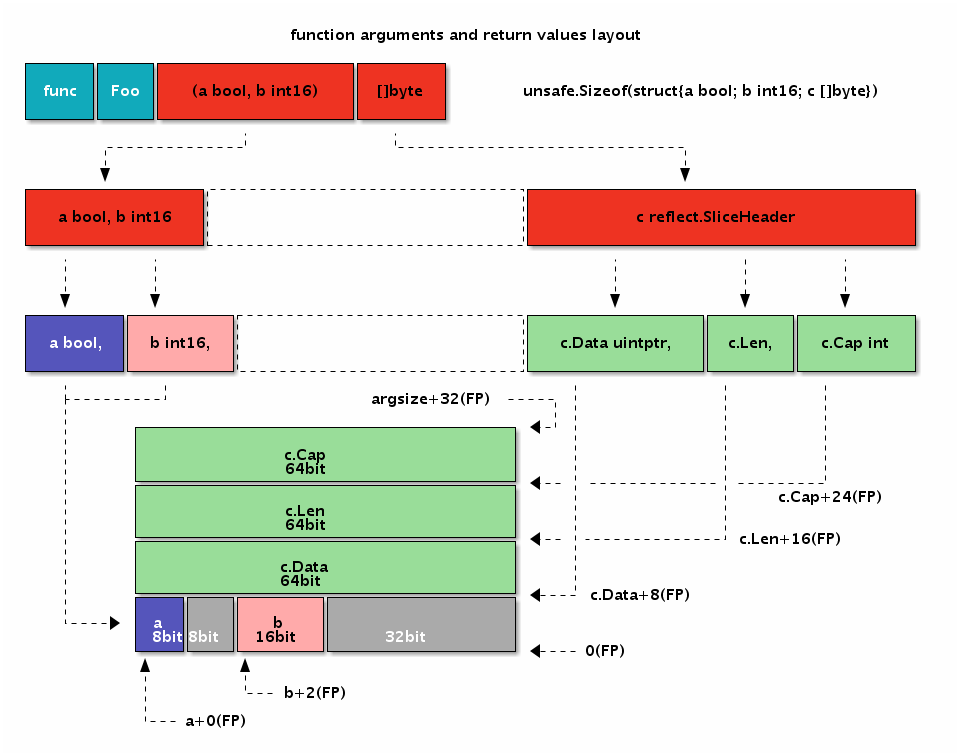

<!--
// Copyright 2018 ChaiShushan <chaishushan{AT}gmail.com>. All rights reserved.
// Use of this source code is governed by a BSD-style
// license that can be found in the LICENSE file.
-->

<!-- ++++++++++++++++++++++++++++++++++++++++++++++++++++++++++++++++++++++  -->

<!-- *** 横向分隔, --- 竖向分隔, Note: 讲稿注释  -->

<!--
Reveal.js 可能会需要 AJAX 异步加载 Markdown 文件, 可以在当前目录启动一个 http 服务.

以下是常见的临时启动 http 服务器的方式:

	NodeJS
	npm install http-server -g
	http-server

	Python2
	python -m SimpleHTTPServer

	Python3
	python -m http.server

	Golang
	go run server.go

启动后, 本地可以访问 http://127.0.0.1:port, 其中 port 为端口号, 命令行有提示.

幻灯片操作: F键全屏, S键显示注解, ESC大纲模式, ESC退出全屏或大纲模式, ?显示帮助

-->

<!-- ++++++++++++++++++++++++++++++++++++++++++++++++++++++++++++++++++++++  -->

# Go汇编语言
-----------

#### [chai2010 (柴树杉)](https://chai2010.cn)
#### [@青云QingCloud](https://www.qingcloud.com/)


<!-- ++++++++++++++++++++++++++++++++++++++++++++++++++++++++++++++++++++++  -->
***
## 汇编语言的价值
--------------

- 挖掘芯片的全部功能 (操作系统引导/进程切换等)
- 挖掘芯片的全部性能 (算法极致优化)

----

- 哪怕只懂一点汇编, 也便于更好地理解计算机
- 汇编语言可以鄙视一切高级语言


---
### Plan9汇编语言
----------------

- Ken Thompson, 1986 写的 C 编译器 输出的伪代码
- Plan9汇编 用于手写 输出的伪代码
- 是一种近似跨平台的高级汇编语言

-------------

- Go汇编是基于Plan9汇编演化而来


---
### 正视汇编语言
--------------

- 高德纳: 过早的优化就是万恶之源
- 但是老高自己的程序都优化变态了!!
- 老高也没让你不会汇编语言

-------------

- Pob Pike: 遇到问题要迎头而上，不要迂回和躲避
- 而汇编语的哲学就是迎头而上的方式解决问题！


-----

- 目的不仅仅是为了快, 更重要的是搞清楚Go的运行原理!
- 汇编语言的模型极其简单, 比任何高级语言都简单!
- 其实一切汇编语言都是纸老虎!


<!-- ++++++++++++++++++++++++++++++++++++++++++++++++++++++++++++++++++++++  -->
***
## 快速入门
----------

```go
package pkg

var helloworld string = "Hello World!"

func HelloWorld() {
	println(helloworld)
}
```

------

- 重新用汇编语言实现

---
### 汇编语言实现
--------------

```
#include "textflag.h"

// var helloworld string
GLOBL ·helloworld(SB),NOPTR,$32                  // var helloworld [32]byte
	DATA ·helloworld+0(SB)/8,$·helloworld+16(SB) // StringHeader.Data
	DATA ·helloworld+8(SB)/8,$12                 // StringHeader.Len
	DATA ·helloworld+16(SB)/8,$"Hello Wo"        // ...string data...
	DATA ·helloworld+24(SB)/8,$"rld!"            // ...string data...

// func HelloWorld()
TEXT ·HelloWorld(SB), $16-0
	MOVQ ·helloworld+0(SB), AX; MOVQ AX, 0(SP)
	MOVQ ·helloworld+8(SB), BX; MOVQ BX, 8(SP)
	CALL runtime·printstring(SB)
	CALL runtime·printnl(SB)
	RET
```

----------


---
### 汇编语法
-----------

- 变量要在Go语言中声明, 但不能赋值
- 函数要在Go语言中声明, 但不包含函数实现

------

- Go语言中的标识符`x`对应汇编语言中的`·x`

------

- GLOBL: 定义全局标识符, 分配内存空间
- DATA: 初始化对应内存空间
- TEXT: 定义函数


---
### 字符串结构
-------------

```go
var helloworld string // 只能声明, 不能赋值
```

```go
// +---------------------------+              ·helloworld+0(SB)
// | reflect.StringHeader.Data | ----------\ $·helloworld+16(SB)
// +---------------------------+           |
// | reflect.StringHeader.Len  |           |
// +---------------------------+ <---------/  ·helloworld+16(SB)
// | "Hello World!"            |
// +---------------------------+
```

-------

- 字符串的数据紧挨字符串头结构体
- `$·helloworld+16(SB)` 表示符号地址
- `·helloworld+16(SB)` 表示符号地址内的数据


---
### HelloWorld函数
-----------------

```go
func HelloWorld() // 只能声明, 不能定义
```

```
TEXT ·HelloWorld(SB), $16-0
	MOVQ ·helloworld+0(SB), AX; MOVQ AX, 0(SP)
	MOVQ ·helloworld+8(SB), BX; MOVQ BX, 8(SP)
	CALL runtime·printstring(SB)
	CALL runtime·printnl(SB)
	RET
```

------

- `$16-0`中的16: 表示函数内部有16字节用于局部变量
- `$16-0`中的0: 表示函数参数和返回值总大小为0

------

- `printstring`的参数类型为`StringHeader`
- `0(SP)`为`StringHeader.Data`
- `8(SP)`为`StringHeader.Len`


---
### 简化: 在Go中定义变量
---------------------

```go
var helloworld string = "你好, 中国!"

func HelloWorld()
```

```
TEXT ·HelloWorld(SB), $16-0
	MOVQ ·helloworld+0(SB), AX; MOVQ AX, 0(SP)
	MOVQ ·helloworld+8(SB), BX; MOVQ BX, 8(SP)
	CALL runtime·printstring(SB)
	CALL runtime·printnl(SB)
	RET
```

-------------

- 汇编定义变量没有太多优势, 性价比较低
- 汇编的优势是挖掘芯片的功能和性能

---
### 没有分号
----------

- 分号用于分隔多个汇编语句
- 行末尾自动添加分号

<!-- ++++++++++++++++++++++++++++++++++++++++++++++++++++++++++++++++++++++  -->
***
## 特殊字符
----------

- `U+00B7`: 中点`·`, 替代ASCII点`.`, 例如 `fmt.Printf`
- `U+2215`: 除法`/`, 替代路径分隔符`/`, 例如 `math/rand.Int`

-------

- `·`和`/`可以看作是特殊的Unicode字母
- 不需要针对包路径中的`.`和`/`字符设计特殊语法
- `math/rand.Int`自然包含了包路径的信息
- 不受汇编语言的小数点和除法运算符影响


---
## 特殊字符怎么输入?
-----------------

- 从 [/doc/asm](https://golang.org/doc/asm) 官方文档 复制/粘贴

------

- macOS: 不开输入法时，可直接用 option+shift+9 输入
- macOS: 简体拼音输入法，输入左上角`~`键对应`·`
- macOS: Unicode输入法，输入对应的Unicode码点
- Windows: TODO
- Linux: TODO

-----

- https://en.wikipedia.org/wiki/Interpunct


---
## 更多的特殊字符?
---------------

-  https://github.com/golang/go/pull/25274
- `pkg.(*T).Method` ?

-----

- 终极方案: Unicode输入法 + 复制粘贴


<!-- ++++++++++++++++++++++++++++++++++++++++++++++++++++++++++++++++++++++  -->
***
## 冯·诺伊曼 计算机
-----------------

- CPU/内存/IO设备
- 程序也是数据, 存储程序, 统一编址
- 哈弗结构: 程序和数据分开编址

-------------------

- CPU 提供一组高速寄存器
- 所有的运算只能在寄存器中进行
- 内存 和 寄存器 之间的数据传输有专有的指令

----------

- 汇编核心内容: 寄存器, 指令, 内存


---
### X64/AMD64架构
----------------

####  <!-- .element: style="width:60%;" -->

#### https://godoc.org/cmd/internal/obj/x86


---
### 内存布局
----------

- text: 代码段(只读)
- rodata: 常量段(只读)
- data: 全局变量
- heap: 堆, 动态内存管理
- stack: 栈, 函数调用栈帧, 局部变量等信息


-----

- Go 的 stack 存在与 heap 中, 大小有界
- Go 的 stack 伸缩时会进行移动位置


---
### 寄存器
---------

- AMD64: AX, BX, CX, DX, SI, DI, SP, BP, SP, R8~R15
- ARM64: R0~R31

-------

- `MOVQ a+0(FP) AX`
- `ADDQ AX BX`

---
### 基本指令类型
--------------

- 数据传输: MOVE, 寄存器 <==> 内存
- CPU 无法对内存的数据进行直接运算

-----------------

- 跳转指令: JMP, 有条件跳转
- 可实现if/else/for等控制结构
- 可绝对地址或相对地址跳转

-----------------

- 逻辑运算: 配合跳转指令
- 算术运算


---
### 精简指令集
-------------

- 数据传输: MOV/LEA
- 跳转指令: CMP/TEST/JMP/JCC
- 栈指令: PUSH/POP
- 函数调用指令: CALL/RET

-----

- 算术指令: ADD/SUB/MUL/DIV
- 逻辑指令: AND/OR/XOR/NOT
- 移位指令: SHL/SHR

------

- JCC有条件跳转: JEQ/JNE/JLT/JLE/JGT/JGE
- 还有针对无符号数的比较条件

<!-- ++++++++++++++++++++++++++++++++++++++++++++++++++++++++++++++++++++++  -->
***
## 伪寄存器
----------

- SB: 静态基址指针, 全局符号
- FP: 帧指针, 参数和局部变量
- SP: 栈指针, 栈的顶端
- PC: 程序计数器, 跳转和分支

-----

- 伪寄存器仅仅存在于Go汇编中


---
### X86/AMD64架构下的伪寄存器
--------------------------

####  <!-- .element: style="width:65%;" -->

------

#### https://golang.org/doc/asm

---
### 真伪寄存器
-------------

- 伪寄存器以标识符为前缀
- 真寄存器没有标识符前缀

-----


- 真寄存器: `AX`, `(AX)`, `+8(AX)`
- 伪寄存器: `a(FP)`, `b+8(FP)`


---
### (真)(伪)SP: 常见于函数中
-------------------------

- 真SP: `(SP)`, `+8(SP)`
- 伪SP: `a(SP)`, `b+8(SP)`

-------

- 真SP: 没有标识符前缀
- 伪SP: 有一个标识符前缀, 对应局部变量名

--------

- 真SP: 调用其它函数时的参数和返回值, 偏移量是正数
- 伪SP: 局部变量, 偏移量是负数

--------

- 真SP: 对应当前函数栈帧的栈定
- 伪SP: 对应当前函数栈帧的栈底


---
### 伪寄存器用法
--------------

- `GLOBL text(SB),$1`: 全局变量
- `MOVQ a+0(FP) AX`: 函数参数
- `MOVQ b+8(SP) AX`: 局部变量
- `JMP  2(PC)`: 向前跳转, 常用于宏函数
- `JMP -2(PC)`: 向后跳转, 常用于宏函数


---
### 函数栈帧和伪寄存器
-------------------

####  <!-- .element: style="width:38%;" -->


<!-- ++++++++++++++++++++++++++++++++++++++++++++++++++++++++++++++++++++++  -->
***
## 常量和全局变量
--------------

- 常量
- 常量示例

------

- 全局变量
- 变量示例


---
### 常量
-------

- `$`前缀表示常量
- 整数常量: 十进制/十六进制
- 浮点数常量: 科学计数法?
- 字符/字符串常量
- 标识符/标号
- 常量表达式


---
### 常量示例
-----------

```
$1           // 十进制
$0xf4f8fcff  // 十六进制
$1.5         // 浮点数
$'a'         // 字符
$"abcd"      // 字符串
$1+2         // 常量表达式
```

------

- 没有类型bool, byte代替
- 最终常量不得超出变量能表示的范围


---
### 全局变量
---------

- 基本语法

---------

- bool/int/float
- string/slice
- map/channel

---------

- NOPTR/RODATA/DUPOK
- 仅文件内可见

---
### 基本语法
-----------

```
DATA symbol+offset(SB)/width, value
```

```
DATA ·count+0(SB)/1,$1
DATA ·count+1(SB)/1,$2
DATA ·count+2(SB)/2,$3

GLOBL ·count(SB),$4
```

------

- `DATA` 符号对应偏移量, 制定宽度内存内的数据
- `GLOBL` 定义全局变量, 只有内存大小, 不包含类型

----

- `DATA` 表示数据在 data 内存段


---
### 全局变量定义(A)
--------------

####  <!-- .element: style="width:60%;" -->

------

```
GLOBL ·num(SB), $16
DATA ·num+0(SB)/8, $0
DATA ·num+8(SB)/8, $0
```

---
### 全局变量定义(B)
----------------

####  <!-- .element: style="width:60%;" -->

-----

####  注意 SB 为寄存器的作用

---
### bool型变量
-------------

```
GLOBL ·boolValue(SB),$1   // 未初始化

GLOBL ·trueValue(SB),$1   // var trueValue = true
DATA ·trueValue(SB)/1,$1  // 非 0 均为 true

GLOBL ·falseValue(SB),$1  // var falseValue = true
DATA ·falseValue(SB)/1,$0
```

------

- 没有bool类型, 定义1字节大小内存即可
- 非 0 均为 true

---
### int型变量
------------

```
GLOBL ·int32Value(SB),$4
DATA ·int32Value+0(SB)/1,$0x01  // 第0字节
DATA ·int32Value+1(SB)/1,$0x02  // 第1字节
DATA ·int32Value+2(SB)/2,$0x03  // 第3-4字节

GLOBL ·uint32Value(SB),$4
DATA ·uint32Value(SB)/4,$0x01020304 // 第1-4字节
```

------

- 不区分 int 和 uint 类型


---
### float型变量
------------


```
GLOBL ·float32Value(SB),$4
DATA ·float32Value+0(SB)/4,$1.5      // var float32Value = 1.5

GLOBL ·float64Value(SB),$8
DATA ·float64Value(SB)/4,$0x01020304 // bit 方式初始化
```

------

- float32/float64 遵循 IEEE754标准
- 作为无符号整数类型时, 整数如果有序, 浮点数也有序

---
### IEEE754 浮点数标准
--------------------

###### 

------------

- 符号位1bit, 在最高位
- float32 指数位为 8bit, 采用移码表示, 在次高位
- 剩余为有效位, 整数部分的1bit省略

--------

- 有2个0: +0, -0
- 有无穷大和无穷小, 无穷有正负之分
- 存在非数 inf

---
### string类型变量
-----------------

```go
type reflect.StringHeader struct {
	Data uintptr
	Len  int
}
```

```
GLOBL ·helloworld(SB),$16            // var helloworld = "Hello World!"
DATA ·helloworld+0(SB)/8,$text<>(SB) // StringHeader.Data
DATA ·helloworld+8(SB)/8,$12         // StringHeader.Len

GLOBL text<>(SB),$16
DATA text<>+0(SB)/8,$"Hello Wo"      // ...string data...
DATA text<>+8(SB)/8,$"rld!"          // ...string data...
```

------------

- 汇编中 string 只是一种结构体
- 头部对应 `reflect.StringHeader` 类型
- $开头表示变量的地址, 比如 `$text<>(SB)`

---
### slice类型变量
---------------

```go
type reflect.SliceHeader struct {
	Data uintptr
	Len  int
	Cap  int
}
```

```
GLOBL ·helloworld(SB),$24            // var helloworld = []byte("Hello World!")
DATA ·helloworld+0(SB)/8,$text<>(SB) // StringHeader.Data
DATA ·helloworld+8(SB)/8,$12         // StringHeader.Len
DATA ·helloworld+16(SB)/8,$16        // StringHeader.Len

GLOBL text<>(SB),$16
DATA text<>+0(SB)/8,$"Hello Wo"      // ...string data...
DATA text<>+8(SB)/8,$"rld!"          // ...string data...
```

-----

- slice 也是结构体
- slice 头部兼容 string 头部


---
### map/channel类型变量
----------------------

```
GLOBL ·m(SB),$8  // var m map[string]int
DATA  ·m+0(SB)/8,$0

GLOBL ·ch(SB),$8 // var ch chan int
DATA  ·ch+0(SB)/8,$0
```

```go
func makemap(mapType *byte, hint int, mapbuf *any) (hmap map[any]any)
func makechan(chanType *byte, size int) (hchan chan any)
```

------

- map/channel 内部均位指针类型
- `runtime·makemap` 函数构建 map
- `runtime·makechan` 函数构建 chan


---
### 结构体变量: image.Point
-------------------------

####  <!-- .element: style="width:60%;" -->

----

- 结构体/数组 对齐和元素的偏移量规则都是类似的

---
### 标识符规则
------------

```
GLOBL file_private<>(SB),$1
GLOBL global_name(SB),$1
```

```
GLOBL ·pkg_name1(SB),$1
GLOBL main·pkg_name2(SB),$1
GLOBL my/pkg·pkg_name(SB),$1
```

---------

- `file_private<>`仅当前文件内可见(`<>`后缀)
- `global_name`为全局变量, 建议避免这种用法!!!

------

- `·pkg_name1`为当前包变量
- `main·pkg_name2`为`main`包的包变量
- `my/pkg·pkg_name`为`my/pkg`包的包变量

---
### 特殊标志
----------

```
#include "textflag.h"

// var const_id int
GLOBL ·const_id(SB),NOPTR|RODATA,$8
DATA  ·const_id+0(SB)/8,$9527
```

-----

- `RODATA`表示数据在只读段定义(`readonly var`)
- `RODATA`赋值将导致`panic`, 无法`recover`
- `NOPTR`表示不含指针


<!-- ++++++++++++++++++++++++++++++++++++++++++++++++++++++++++++++++++++++  -->
***
## 函数
-------

- 基本语法
- 函数参数和返回值
- 函数中的局部变量
- 调用其它函数
- 宏函数

---
### 基本语法
----------

```
// func Add(a, b int) int
TEXT main·Add(SB), NOSPLIT, $0-24
TEXT ·Add(SB), $0
```

--------

- `TEXT` 表示在 text 段定义函数
- `main·Add` 中的 main 为包名和路径, 缺少时为当前包
- `main·Add` 中的 Add 为函数名字
- `NOSPLIT` 相关标志, 可省略

------

- `$0-24` 中的 `-` 为分隔符
- `$0-24` 中的 `0` 为局部变量大小(stack frame size)
- `$0-24` 中的 `24` 为参数和返回值大小(缺少时自动计算)


---
### 函数定义
-----------

####  <!-- .element: style="width:80%;" -->

----

- Go汇编中参数和返回值没有区别


---
### 函数也没有类型
---------------

```
func Foo(a, b int) int
func Foo(a, b, c int)
func Foo() (a, b, c int)
```

----

- 以上函数在汇编中是一样的
- 汇编中, 函数也没有类型, 类型在Go中定义
- 汇编只需要函数的名字和各个参数的偏移位置


---
### 函数参数和返回值(A)
-----------------

```go
func Foo(a, b int) (c int)
```

```go
func Foo(FP *struct{a, b, c int})
```

```
TEXT ·Foo(SB), $0
	MOVEQ a+0(FP), AX  // a
	MOVEQ b+8(FP), BX  // b
	MOVEQ c+16(FP), CX // c
	RET
```

-----

- 将参数和返回值等价变换到一个结构体中
- FP 伪寄存器对应唯一结构体参数的指针
- 成员名加偏移量可定位每个参数


---
### 函数参数和返回值(B)
--------------------

####  <!-- .element: style="width:80%;" -->


---
### 函数参数大小计算(A)
--------------------

```go
func SomeFunc(a, b int, c bool) (d float64, err error) int

type SomeFunc_args_and_returns struct {
	a   int
	b   int
	c   bool
	d   float64
	err error
}
```

-----------

- 将参数和返回值看着一个结构体(保存原有的顺序)
- 结构体的大小就是函数的参数和返回值大小
- 结构体中成员的偏移量就是每个参数的偏移量
- 每个成员需要进行内存对齐


---
### 函数参数大小计算(B)
--------------------

####  <!-- .element: style="width:70%;" -->


---
### 函数中的局部变量
-----------------

```go
func Foo() { var a, b, c int }
```

```go
func Foo() { var local [1]struct{c, b, a int}; var SP = &local[1]; }
```

```
TEXT ·Foo(SB), $24
	MOVQ c-8*1(SP), CX // c
	MOVQ b-8*2(SP), BX // b
	MOVQ a-8*3(SP), AX // a
	RET
```

------


- 将所有局部变量(逆序)等价变换到一个结构体中
- 结构体的大小就是函数帧大小(stack frame size)

----

- SP (伪)寄存器对应局部变量结构体的(末尾)地址
- 成员名加(负)偏移量可定位每个局部变量


---
### 函数中的局部变量(B)
-----------------


####  <!-- .element: style="width:70%;" -->


---
### 调用其它函数
--------------

```go
func foo() {
	var a, b int
	bar(b)
}

func bar(a int) {}
```

```
TEXT ·foo(SB), $24
	MOVQ b-8*1(SP), BX // b
	MOVQ a-8*2(SP), AX // a

	MOVQ BX, +0(SP)
	CALL ·bar(SB)
	RET
```

----

- 真SP对应被调用函数的伪FP
- 真SP调用参数要符合被调用函数的参数布局
- 真SP对应空间也是(stack frame size)一部分(`$24`)


---
### 调用其它函数 - 栈帧布局
-------------------------

####  <!-- .element: style="width:60%;" -->

---
### 调用其它函数 - 寄存器保存
-------------------------

- 调用其它函数前: 保存相关寄存器到栈中
- 调用其它函数后: 从栈恢复相关寄存器

-----

- 根据使用情况, 选择要恢复的寄存器进行保存


---
### 宏函数
---------

```
#define ADD(off_a, off_b)                  \
	MOVQ a+off_a(FP), AX; /* a */          \
	MOVQ b+off_b(FP), BX; /* b */          \
	ADDQ AX, BX;          /* a+b */        \
	MOVQ BX, ret+16(FP);  /* return a+b */ \
	RET

// func (a Int) Add(b int) int
TEXT ·Add(SB), NOSPLIT, $0-24
	ADD(0, 8)
```

--------

- Go汇编支持C语言的预处理语法
- 宏函数就是一个带参数的宏
- 可通过宏参数替换寄存器名
- 每个指令结尾需要手工分号


---
### 宏函数 - go_asm.h
--------------------

```
#include "go_asm.h"

TEXT ·foo(SB), $0
	get_tls(CX)
	MOVQ g(CX), AX     // Move g into AX.
	MOVQ g_m(AX), BX   // Move g.m into BX.
```

------

- 获取 runtime 中 goroutine 的结构

<!--

swap 宏函数，交换寄存器的值
顺便介绍下swap的三种算法，有不带临时变量的

-->

<!-- ++++++++++++++++++++++++++++++++++++++++++++++++++++++++++++++++++++++  -->
***
## 控制流
--------

- 数据传输
- 比较指令
- 跳转指令
- 算术指令

-------

- 分支: if/ifelse
- 循环: for

---
### 全部的基础指令
---------------

- 数据传输: MOVQ
- 无条件跳转: JMP
- 有条件跳转: JL/JLE/JZ/JNE
- 加法/减法: ADDQ/SUBQ

------

- 基于以上指令可以编写大部分非运算型代码


---
### 数据传输指令
--------------

```
MOVQ $0, AX
MOVQ AX, BX
MOVQ arg+0(FP), AX
MOVQ BX, ret+0(SP)
```

----

- 常量到寄存器
- 寄存器之间传输输出
- 寄存器和内存之间

------

- 无法在内存之间直接传输

<!-- MOV 指令的后缀 -->

---
### 比较指令
-----------

- TEST: 逻辑与运算结果为零, 把ZF(零标志)置1
- CMP: 算术减法运算结果为零, 就ZF(零标志)置1.

----

- TEST 也可以用 `AND`/`CMP` 模拟


---
### 跳转指令
-----------

- 无条件跳转: JMP
- 有条件跳转: JL/JLE; JZ/JNZ

--------

- JMP/JL: 跳转和小于跳转可以模拟其它跳转
- JL/JLE: 小于/小于等于 跳转
- JZ/JNZ: 零/非零 跳转

--------

- 缩写单词: J(MP), L(ess), E(qual), Z(ero), N(ot)


---
### 相对跳转/绝对跳转
------------------

- `JZ 3(PC)` 向后跳转2个指令
- `JMP LOOP` 跳转到 `LOOP` 标号对应位置

----

- 跳转距离较大时, 尽量用标号跳转


---
### 算术指令
----------

- 加法: ADDQ
- 减法: SUBQ

--------------

- 加法/减法 是循环和迭代常见的操作
- 复杂的条件 还需要逻辑运算


---
### if: 汇编思维改写Go代码
-----------------------

```go
func If(ok bool, a, b int) int {
	if ok { return a } else { return b }
}
```

```go
func If(ok bool, a, b int) int {
	if ok == 0 { goto L }
	return a
L:  return b
}
```

------

- 每个表达式只能有一个运算符
- if 只能是 `<`/`<=`/`==` 几种比较符号
- if 的 body 部分只能是一个 goto 语句


---
### if: 转译为汇编
---------

```
TEXT ·If(SB), NOSPLIT, $0-32
	MOVBQZX ok+8*0(FP), CX // ok
	MOVQ    a+8*1(FP), AX  // a
	MOVQ    b+8*2(FP), BX  // b

	CMPQ    CX, $0         // test ok
	JZ      L              // if !ok, skip 2 line
	MOVQ    AX, ret+24(FP) // return a
	RET

L:
	MOVQ    BX, ret+24(FP) // return b
	RET
```

-------

- if 语句是控制流的基础
- if+goto 可实现循环

---
### for 循环
-----------

```go
func LoopAdd(cnt, v0, step int) int {
	result := v0
	for i := 0; i < cnt; i++ {
		result += step
	}
	return result
}
```

------

- for 的三个部分: 初始化, 结束条件, 迭代步长
- for 可以模拟其它各种循环


---
### for - 展开为 if/goto
-----------------------


```go
func LoopAdd(cnt, v0, step int) int {
	var i = 0
	var result = v0

LOOP:
	if i < cnt { goto LOOP_BODY }
	goto END

LOOP_BODY
	i = i+1
	result = result + step
	goto LOOP

END:
	return result
}
```

--------

- if/goto <==> 比较+有条件跳转+无条件跳转

---
### for - 汇编重写(A)
------------

```
// func LoopAdd(cnt, v0, step int) int
TEXT ·LoopAdd(SB), NOSPLIT, $0-32
	MOVQ cnt+0(FP), AX   // cnt
	MOVQ v0+8(FP), BX    // v0/result
	MOVQ step+16(FP), CX // step
	MOVQ $0, DX          // i

LOOP:
	// ....
```

-----

- v0 和 result 复用一个寄存器

---
### for - 汇编重写(B)
--------------------

```
// func LoopAdd(cnt, v0, step int) int
TEXT ·LoopAdd(SB), NOSPLIT, $0-32
	// ...
LOOP:
	CMPQ DX, AX          // compare i, cnt
	JL   LOOP_BODY       // if i < cnt: goto LOOP_BODY
	goto END

LOOP_BODY:
	ADDQ $1, DX          // i++
	ADDQ CX, BX          // result += step
	goto LOOP

END:
	MOVQ BX, ret+24(FP)  // return result
	RET
```

-------

- 循环优化: `for ; cnt >= 0; cnt--`

<!-- go&defer&闭包 也是控制流一部分 -->

<!-- ++++++++++++++++++++++++++++++++++++++++++++++++++++++++++++++++++++++  -->
***
## 再论函数
----------

- 递归函数
- 栈的动态伸缩
- 动态栈中的指针
- ...

---
### 递归函数: 1到n求和
--------------------

```go
// sum = 1+2+...+n
// sum(100) = 5050
func sum(n int) int {
	if n > 0 { return n+sum(n-1) } else { return 0 }
}
```

------

- sum为递归版本的1到n等差数列求和
- Go中的递归不用担心爆栈问题

---
### 递归函数: if+goto改写
-----------------------

```go
func sum(n int) (result int) {
	var temp1 int
	var temp2 int

	if n > 0 { goto L_STEP_TO_END }
	goto L_END

L_STEP_TO_END:
	temp1 = n-1
	temp2 = sum(temp1)
	result = n + temp2
	return result

L_END:
	return 0
}
```

-----

- 递归调用的参数需要引入局部变量
- 保存中间结果也需要引入局部变量

---
### 递归函数: 汇编实现: 参数和变量
-----------------------------

```
// func sum(n int) (result int)
TEXT ·sum(SB), NOSPLIT, $16-16
	MOVQ n+0(FP), AX       // n
	MOVQ result+8(FP), BX  // result

	MOVQ $0, temp2-8*1(SP) // DX: temp2
	MOVQ $0, temp1-8*2(SP) // CX: temp1

	// ...
```

----

- 函数参数和返回值
- 局部变量的顺序和Go代码相反(先定义的地址小)

----

- 刚好满足 `temp2 = sum(temp1)` 的内部布局


---
### 递归函数: 汇编实现: 条件跳转
----------------------------

```
// func sum(n int) (result int)
TEXT ·sum(SB), NOSPLIT, $16-16
	// ...

	CMPQ AX, $0            // test n - 0
	JLE  L_END             // if <= 0: goto goto LEND
	// JMP  L_STEP_TO_END  // goto L_STEP_TO_END

L_STEP_TO_END:
	// ...

L_END:
	// ...
```

-----

- `if n > 0` 反向 `if 0 < n` 可转为小于比较

---
### 递归函数: 汇编实现: 递归调用
----------------------------

```
L_STEP_TO_END:
	MOVQ AX, CX            // CX: temp1 = n
	ADDQ $-1, CX           // CX: temp1 += -1
	MOVQ CX, temp1-8*2(SP)

	MOVQ CX, 0(SP)         // arg: n-1
	CALL ·sum(SB)
	MOVQ 8(SP), BX         // DX: temp2 = sum(n-1)

	MOVQ n+0(FP), AX       // n
	ADDQ AX, BX            // DX: temp2 += n
	MOVQ BX, result+8(FP)  // return result
	RET
```

-----

- `sum(n-1)`参数: `0(SP)` 或 `temp1-8*2(SP)`
- `sum(n-1)`返回值: `8(SP)` 或 `temp2-8*1(SP)`

-----

- 调用子函数后, 全部寄存器将失效!!!

---
### 递归函数: 汇编实现: 终结条件
----------------------------

```
// func sum(n int) (result int)
TEXT ·sum(SB), NOSPLIT, $16-16
	// ...

L_END:
	MOVQ $0, result+8(FP) // return 0
	RET
```

-----

- 直接返回结果将终结递归调用


---
### 递归爆栈问题
--------------

- 深度递归将导致栈增长越界, 也就是爆栈
- Goroutine的初始栈很小(可能是4KB), 很容易超出
- 上面的递归求和实现, 数据超过100时就容易触发爆栈

----

- 但是 Go 语言实现的递归很少有爆栈现象

---
### 栈的扩容
-----------

```
TEXT ·sum(SB), $32-16
	NO_LOCAL_POINTERS

L_START:
	MOVQ TLS, CX          // get tls
	MOVQ 0(CX)(TLS*1), AX // get g
	CMPQ SP, 16(AX)       // get stack
	JLS  L_MORE_STK

	// body ...

L_MORE_STK:
	CALL runtime·morestack_noctxt(SB)
	JMP  L_START
```

-----

- 函数开头先判断栈是否够用
- `runtime·morestack_noctxt` 将请求更多栈空间

---
### 动态栈中的指针 - FUNCDATA
---------------------------

- FUNCDATA 标志参数和局部变量的指针 `funcdata.h`
- `FUNCDATA $PCDATA_StackMapIndex `


<!-- ++++++++++++++++++++++++++++++++++++++++++++++++++++++++++++++++++++++  -->
***
## 例子: Goroutine ID
---------------------

<!--
- 方法1: 获取g指针，通过id便宜量获取id
- 问题: 在不同Go版本中，id的偏移有变化（私有成员）
- 改进：针对不同版本分别定义偏移量，或者保存到 map 中
- 问题：出新的Go版本时需要时刻更新map表格
- 改进：获取runtime.g结构体的信息，有2个方法

1是利用link特性，reflect内部函数遍历全部的类型（可以改造为遍历某个包到全部类型）。
2是用type.runtime.g获取类型，然后通过 runtime.convertT2E 生成接口，有了接口再通过reflect查询offset私有成员到值

问题：是否可以查到 id 成员的偏移量？

最后一种可一致性最好，虽然type.runtime.g和 runtime.convertT2E都是私有成员，但是对于汇编来说，
2个名字是相对稳定的，比reflect.listtype1更稳定。

https://zhuanlan.zhihu.com/p/33567726
https://www.jianshu.com/p/85a08d8e7af3

https://github.com/petermattis/goid

https://golang.org/src/runtime/HACKING.md

基于 goid 打造一个 gls，如何回收呢？
在启动时defer 完成回收

panic 信息中也有 gid，可以作为测试

http2
https://github.com/golang/net/blob/master/http2/gotrack.go

-->

TODO

<!--
- 2类方法的定义
- 类型信息标识符
- 转为接口/接口断言/接口查询
- 通过接口调用方法函数

http://legendtkl.com/2017/06/12/understanding-golang-interface/
http://legendtkl.com/2017/07/01/golang-interface-implement/

https://golang.org/src/runtime/iface.go
-->


<!--

 高级汇编技巧
-------------

TODO

- AVX/SSE指令（这个不是技巧吧？）
- textflag.h，link name，取出私有变量
- 调用C叶子函数, 假设栈够用
- 生成动态执行代码


-->


<!-- ++++++++++++++++++++++++++++++++++++++++++++++++++++++++++++++++++++++  -->
***
## 参考资源

#### https://golang.org/doc/asm
#### https://9p.io/sys/doc/asm.html
#### https://talks.golang.org/2016/asm.slide
#### https://github.com/klauspost/asmfmt
#### https://github.com/minio/asm2plan9s

-------

#### [runtime builtin functions](https://golang.org/src/cmd/compile/internal/gc/builtin/runtime.go)


<!-- ++++++++++++++++++++++++++++++++++++++++++++++++++++++++++++++++++++++  -->
***

## Thank you

#### [https://github.com/chai2010](https://github.com/chai2010)

#### [https://chai2010.cn](https://chai2010.cn)

#### [@青云QingCloud](https://www.qingcloud.com/)


<!-- ++++++++++++++++++++++++++++++++++++++++++++++++++++++++++++++++++++++  -->
